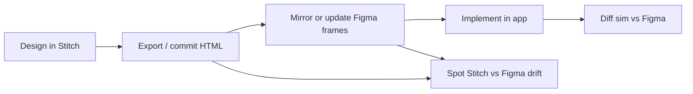

# Design sources — Stitch → Figma → code

Grace designs in **Google Stitch**, exports HTML into the repo, promotes frames into the **Sloe · Screens** Figma file for agent-friendly documentation, and ships implementation on **iOS** (primary) with web parity where applicable.

This doc is the single map for that pipeline. It does not replace surface-specific dossiers (`today-ios-dossier.md`, decision records under `docs/decisions/`).

---

## Three sources of truth (and what each is for)

| Layer | Location | Role | Confidence for agents |
|-------|----------|------|------------------------|
| **1 · Stitch HTML** | `docs/prototypes/stitch-sloe/*.html` | Generation and export from Stitch; committed static mocks; rebuilt by `_gen.mjs` and screen-specific `_build*.mjs` scripts | **High** for copy, component grouping, and Tailwind-class measurements when HTML is fresh. **Low** if Grace has not re-exported after a Figma sync. |
| **2 · Figma frames** | [Sloe · Screens](https://www.figma.com/design/B3UdOFup7ITersgNuoXh0l/) — page **01 · Core app** | Documentation house for Grace and Cursor; frame IDs are stable handles for MCP screenshots and audits | **High** for “what we document” after Grace mirrors Stitch. **Authoritative for documentation** when Stitch and Figma disagree (see below). |
| **3 · iOS simulator (and app code)** | `apps/mobile/`, booted sim via `ios-simulator` MCP | Shipped UI; may intentionally diverge from mocks per `docs/decisions/` | **Ground truth for users.** Compare to Figma for gaps; compare to Stitch to spot export drift. |

**Web** Today is still on an older grammar in places; mobile Sloe leads until `sync-enforcer` closes web parity (see `2026-06-04-today-stitch-measured-spec-pass.md`).

---

## Frame ↔ Stitch HTML mapping (Today)

All frames sit on **01 · Core app** in file `B3UdOFup7ITersgNuoXh0l`. Together they describe the full Today scroll; hero frame `308:2` does **not** include TD1/TD2 blocks.

| Figma frame | Node ID | Stitch HTML | App surface (mobile) |
|-------------|---------|-------------|----------------------|
| **01 · Today** | `308:2` | `today.html` | Hero slice: wordmark, greeting, week strip, ring, macros, coach, what-to-eat-next, meals header — **not** activity/hydration |
| **TD1 · Activity & energy** | `459:2` | `today-activity.html` | `TodayActivityCard`, `TodayActivityBonusCard` (below fold) |
| **TD2 · Hydration & stimulants** | `463:2` | `today-hydration.html` | `HydrationStimulantsCard` |
| **TD3 · Weekly insight & planned** | `480:2` | `today-insight.html` | `WeeklyInsightCard` + planned block (structural spec) |
| **TD4 · Meal log** | `481:2` | `today-meallog.html` | `TodayMealsSection` per-slot cards |

**Build commands (from repo root):**

```bash
node docs/prototypes/stitch-sloe/_buildtoday.mjs          # today.html (+ variants)
node docs/prototypes/stitch-sloe/_buildtoday-sections.mjs # today-activity, hydration, insight, meallog
```

Stitch HTML includes Figma capture helper script (`mcp.figma.com/mcp/html-to-design/capture.js`) so Grace can push HTML into Figma from the browser.

---

## End-to-end workflow



1. **Design in Stitch** — layout, copy, tokens (plum/clay/sage, Newsreader + Inter).
2. **Export → repo** — save or regenerate HTML under `docs/prototypes/stitch-sloe/`; commit with the feature or audit PR. Prefer editing `_build*.mjs` / `_gen.mjs` and re-running generators over hand-editing generated HTML (hand edits get overwritten).
3. **Promote to Figma** — capture or rebuild frames `308:2`, `459:2`, `463:2`, `480:2`, `481:2` so agents and Grace share one visual house. Update frames when HTML changes materially.
4. **Implement** — mobile first for Sloe Today; record intentional deltas in `docs/decisions/`.
5. **Verify** — `docs/testing/figma-vs-simulator.md` workflow: Figma MCP + ios-simulator MCP; scroll full Today; respect intentional drift table.
6. **Drift hygiene** — when Stitch HTML still shows an old pattern but Figma and decisions say otherwise, treat as **Stitch export lag** until Grace re-exports or updates `_buildtoday.mjs`. Log known gaps in `docs/testing/figma-today-consistency-audit.md` § Stitch ↔ Figma.

---

## When Stitch and Figma disagree

| Situation | Rule |
|-----------|------|
| Grace has synced Figma after a Stitch pass | **Figma wins for documentation** — agents cite frame IDs and Figma MCP captures. |
| Code vs Figma | Follow **decision records** first (`docs/decisions/`), then Figma, then Stitch HTML. |
| Stitch HTML vs Figma (no decision yet) | Open an audit row in `figma-today-consistency-audit.md`; do not silently “fix” code to match stale HTML. |
| Stitch measured-spec note vs newer decision | **Newer `docs/decisions/` entry wins** (e.g. status chip: `2026-06-04-today-status-chip-budget-labels.md` supersedes “On track” in `2026-06-04-today-stitch-measured-spec-pass.md`). |

---

## Stitch MCP (optional, user machine only)

Agents can read live Stitch projects via Google’s MCP endpoint when configured in the **user** `~/.cursor/mcp.json` (never commit API keys). Setup: `docs/testing/agent-eyes-and-hands.md` § Stitch MCP.

Use Stitch MCP when you need **current** Stitch project state not yet exported to `docs/prototypes/stitch-sloe/`. Use committed HTML when the repo export is known fresh. Use Figma MCP for documentation captures and sim diff for shipped UI.

---

## Related docs

| Doc | Purpose |
|-----|---------|
| `docs/testing/figma-vs-simulator.md` | Agent diff workflow (Figma + sim) |
| `docs/testing/figma-today-consistency-audit.md` | Known Stitch ↔ Figma ↔ sim inconsistencies |
| `docs/decisions/2026-06-04-today-stitch-measured-spec-pass.md` | Measured hero pass (coach, ring 48px, macro bars) |
| `docs/decisions/2026-06-03-today-week-strip-minimal-current-day.md` | Week strip — no clay pill |
| `docs/decisions/2026-06-04-today-status-chip-budget-labels.md` | Status chip Under / Over budget |
| `docs/ux/redesign/today-ios-dossier.md` | Mobile Today implementation map |
| `docs/prototypes/stitch-sloe/_gen.mjs` | Shared Sloe HTML primitives (rings, icons, tab bar) |
